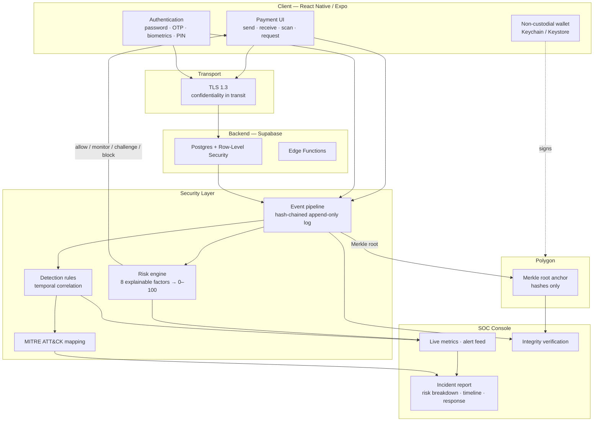

# GlobalPay Secure — Security Architecture

This document describes the security layer added on top of the GlobalPay
payment application: what it defends against, how each control works, and —
just as importantly — what each control does **not** do.

---

## 1. Positioning

GlobalPay began as a non-custodial cross-border payment app on Polygon.
GlobalPay Secure extends it into a system that is simultaneously a **blockchain
project** and a **cybersecurity project**, without either half being decorative:

| Concern | Mechanism | Where it lives |
|---|---|---|
| Confidentiality in transit | TLS / HTTPS | Transport (Supabase, RPC endpoints) |
| Confidentiality at rest | iOS Keychain / Android Keystore | `services/secure-storage.ts` |
| Authentication | Password, OTP, biometrics, app-lock PIN | `context/auth-context.tsx`, `context/app-lock-context.tsx` |
| Authorisation | Postgres Row-Level Security | `supabase-*.sql` |
| Risk-based access control | Explainable risk engine | `services/security/risk-engine.ts` |
| Threat detection | Correlation rules → alerts | `services/security/detection-rules.ts` |
| Monitoring & response | SOC console + analyst triage | `app/soc/`, `services/security/alert-status.ts` |
| Injection visibility | Input guard feeding the SOC | `services/security/input-guard.ts` |
| **Audit integrity** | **Hash chain + Merkle root on Polygon** | `services/security/blockchain-anchor.ts` |

The last row is the only one where blockchain appears, and that is deliberate.

---

## 2. The blockchain claim, stated precisely

A frequent and incorrect claim is "we used blockchain, so the data is secure."
Blockchain provides **integrity, immutability and non-repudiation**. It does
*not* provide confidentiality, it does *not* encrypt anything, and it does *not*
protect data in transit.

| Requirement | Correct technology | Not blockchain |
|---|---|---|
| Nobody can read the request in flight | TLS 1.3 | ✗ |
| Nobody can read the database if stolen | AES / Keychain | ✗ |
| Nobody can silently alter the audit log | **Merkle root anchored on-chain** | ✓ |

So GlobalPay Secure anchors **hashes only**. No event contents, personal data,
balances, or wallet addresses are ever published on-chain.

> **The answer to "why blockchain?"**
> "Blockchain is not used for payment processing or network encryption. It is
> used as an immutable audit layer: security events are hashed into a Merkle
> tree and the root is anchored on Polygon, so any later modification of the
> records becomes detectable. Communication security is handled by TLS and
> storage security by hardware-backed keystores."

### 2.1 Why two mechanisms, not one

**Mechanism 1 — the hash chain.** Each event stores the hash of the event
before it:

```
e₀.hash = H(e₀.payload ‖ GENESIS)
e₁.hash = H(e₁.payload ‖ e₀.hash)
e₂.hash = H(e₂.payload ‖ e₁.hash)
```

Editing or deleting any event changes its hash and breaks every link after it.
This catches casual tampering instantly.

**The gap.** An attacker who understands the scheme edits event `e₁` *and*
recomputes `e₂…eₙ`. The chain is now internally consistent and local
verification passes. This is a real, demonstrated limitation — `tests/audit-chain.test.ts`
contains a test that proves the local check fails to catch it.

**Mechanism 2 — the anchored Merkle root.** The root of the tree over all event
hashes is published to Polygon. The attacker controls our database but cannot
rewrite a confirmed transaction on a public chain. When the log is re-verified,
the recomputed root no longer matches the anchored one, and the tampering is
proven. The companion test asserts exactly this.

### 2.2 Why a Merkle tree rather than one big hash

A single hash over the batch would also detect tampering. A Merkle root
additionally supports **inclusion proofs**: proving that one specific event was
in the anchored batch requires only `log₂(n)` sibling hashes rather than the
whole log. That matters when proving a single disputed transaction to an auditor
without disclosing every other customer's events.

---

## 3. System architecture



### 3.1 Request flow

```
User action (login / payment)
        │
        ▼
Authentication  ── password · OTP · biometric · PIN
        │
        ▼
Risk engine     ── scores against the account's OWN prior history
        │
        ├── score < 25  → allow
        ├── 25–49       → monitor
        ├── 50–74       → challenge (step-up auth)
        └── ≥ 75        → block
        │
        ▼
Security event emitted, hash-chained into the audit log
        │
        ├──► Detection rules correlate across the stream → alerts
        │              │
        │              └──► SOC console (metrics · alerts · incident reports)
        │
        └──► Merkle root anchored on Polygon → tamper-evident audit trail
```

---

## 4. The risk engine

### 4.1 Why rules, not a neural network

Financial regulators require adverse decisions (a blocked payment) to be
explainable. A fraud model trained on a student project's synthetic data would
be both *worse* and *less defensible* than transparent weighted heuristics.

Each factor is an independent detector with a bounded contribution; the score is
their sum, clamped to 100. This is the same additive, per-feature-attribution
shape that SHAP produces for a tree model — so if a trained model is introduced
later, the `RiskFactor[]` contract does not change and the SOC UI keeps working.

### 4.2 Factors

| Factor | Max | Fires when |
|---|---|---|
| Unrecognised device | 20 | Device has no history older than the 24-hour trust window |
| Impossible travel | 30 | Implied travel speed > 900 km/h over > 100 km |
| Anonymising network | 15 | Source IP is a known VPN / Tor / hosting range |
| Failed-auth burst | 25 | ≥ 3 auth failures in 15 minutes (scales to 6+) |
| Payment velocity | 20 | ≥ 3 payments in 10 minutes |
| Amount anomaly | 25 | > 2× previous maximum or > 5× the account mean |
| Unusual hour | 10 | Action between 01:00 and 05:00 local |
| First-time recipient | 12 | Counterparty has never been paid before |

### 4.3 A subtlety worth defending in a review

Risk is scored **only against events strictly earlier than the action**.

Including the action in its own history is a genuine bug that this project hit
and fixed: the attacker's device would already appear "known" and their payee
already "seen", so a textbook account takeover scored **0/100**. The regression
test `ignores events at or after the moment being scored` locks this behaviour
in.

Relatedly, a device is trusted only after it has history **older than 24 hours**
— not merely "seen once". Otherwise an attacker's very first event registers
their device and every subsequent action looks familiar.

---

## 5. Detection rules

The risk engine scores a *single* action. Detection rules look across the event
stream for patterns visible only in aggregate. This mirrors the split a real
SIEM makes between risk-based authentication and detection content.

| Rule | Severity | MITRE |
|---|---|---|
| Credential Stuffing | critical | T1110.004, T1110 |
| PIN Brute Force | high | T1110, T1110.001 |
| Impossible Travel | high | T1078, T1539 |
| Account Takeover Sequence | critical | T1078, T1098, T1657 |
| Payment Velocity Anomaly | high | T1657 |
| Large Transfer Anomaly | medium | T1657 |
| High-Value Transfer from New Device | high | T1078, T1657 |
| Injection Attempt | critical | T1190 |
| Private Key Export | critical | T1555, T1552, T1041 |

Every rule ships with its ATT&CK mapping and remediation steps, so a fired alert
arrives with the context an analyst needs to act.

---

## 5a. Analyst triage

Alerts are **derived**, not stored — they are recomputed from the event log on
every read. Triage state therefore cannot live on the alert itself, so it is
held in a separate store keyed by alert id (`alert-status.ts`).

This is why alert ids are derived from `ruleId + first evidence event id` rather
than randomised: a random id would change identity on every recomputation and
orphan the analyst's decision.

Separating the two also has a security benefit. The evidence stays immutable and
hash-chained; the human judgement about it stays mutable. An analyst marking
something a false positive can never alter the events that produced it.

Transitions are constrained rather than free-form:

```
open          → investigating | false_positive
investigating → contained | resolved | false_positive
contained     → resolved | investigating
resolved      → open        (reopen is explicit)
false_positive→ open
```

Only `open`, `investigating` and `contained` count toward the "open alerts"
metric — closing an alert is what makes the number mean something.

---

## 5b. Injection detection — and what actually prevents injection

`input-guard.ts` pattern-matches user input for SQL, NoSQL, script and template
injection. It is important to be precise about its role in a viva:

**It is not the defence.** Protection against SQL injection comes from
parameterised queries — the Supabase client binds values rather than
concatenating them — plus Row-Level Security constraining what any query can
reach. Blocklist matching is a famously leaky way to *prevent* injection;
encodings and comment tricks defeat it eventually.

**It is visibility.** Someone typing `' OR '1'='1` into a recipient field is not
a confused user. The guard exists so the SOC learns an endpoint is being probed
long before a payload succeeds. A hit means "this session is hostile", not "we
just stopped a breach".

Alongside it, `isValidRecipient()` is an **allowlist** — it defines what a valid
identifier looks like and rejects everything else. That is strictly stronger
than a blocklist, because it rejects the unanticipated rather than only the
foreseen.

---

## 6. Attack simulation

`services/security/attack-simulator.ts` generates realistic event sequences so
the pipeline can be demonstrated on demand.

**Scope, deliberately:** it writes synthetic entries into our *own* event store.
It sends no network traffic, touches no third party, and cannot be pointed at
another system. It is a fixture generator, not an attack tool. Every simulated
event carries `simulated: true` so a drill is never mistaken for a real incident.

Attack scenarios prepend a **legitimate baseline** (days-old activity from a
trusted device) because every anomaly detector is comparative — "unrecognised
device" and "amount anomaly" are meaningless without a normal to deviate from.

---

## 7. Known limitations

Stating these honestly is part of the work.

1. **Client-side scoring.** The risk engine currently runs in-app. An attacker
   controls their own client, so this is a demo affordance, not a production
   control. The engine is written as a pure function with no React, storage, or
   native imports *specifically* so it can be lifted verbatim into a Supabase
   Edge Function. That is the intended next step.

2. **Local event storage.** Events persist in AsyncStorage so the SOC works with
   zero backend setup. `supabase-security.sql` provides the server-side schema
   for moving this to Postgres with RLS.

3. **Anchoring defaults to local.** Computing and sealing the root locally still
   proves the log has not changed *since* the anchor. Publishing to Polygon
   additionally proves the root itself was not rewritten, and needs a funded
   testnet wallet. Both modes are implemented; `local` is the default so the
   console works out of the box.

4. **Geolocation is coarse and self-reported.** City-centroid coordinates only —
   never precise location. A determined attacker can spoof their apparent
   origin; impossible-travel detection raises cost, it does not guarantee.

5. **Web build secret storage.** `expo-secure-store` has no web implementation,
   so the web target falls back to `localStorage`, which is *not* hardware-backed.
   The web build is a development and SOC-analyst surface; real wallet custody
   belongs on native.

---

## 8. Verification

```bash
npm test        # 51 tests across the security layer
npm run typecheck
```

The suite covers the claims this document makes, including the two that matter
most:

- `detects an edited event` — the hash chain catches naive tampering.
- `catches a tampered log even after every hash is recomputed` — the anchored
  Merkle root catches sophisticated tampering that the chain alone cannot.
